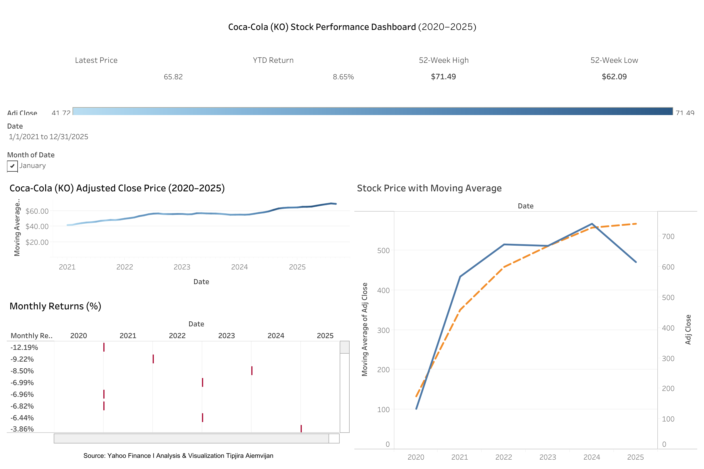

README.md
# Coca-Cola (KO) Stock Analysis – Tableau
## Live Dashboard
🔗 Tableau Public: https://public.tableau.com/views/Book1_17593617144170/Dashboard1?:language=en-US&publish=yes&:sid=&:redirect=auth&:display_count=n&:origin=viz_share_link
 Tableau Dashboard
**View interactive dashboard:**  
[Tableau Public Link](https://public.tableau.com/views/Book1_17593617144170/ForecastScenarioAnalysis?:language=en-US&:sid=&:redirect=auth&:display_count=n&:origin=viz_share_link)
## Dashboard Preview

This repository contains a financial analysis project on Coca-Cola (KO) using Tableau.

The project focuses on stock performance metrics such as:
- Latest Price
- YTD Return
- 52-Week High & Low
- Monthly Returns
- Moving Average trends
- Forecast uncertainty visualization (confidence bands)
Dashboard built using Tableau Public and historical market data
## Key Insights
- Coca-Cola (KO) shows steady long-term price appreciation, consistent with a defensive consumer staples stock.
- YTD return and 52-week high/low indicators highlight limited volatility compared to growth equities.
- Moving average trends confirm stable momentum with temporary drawdowns during broader market uncertainty.
- Monthly return distribution suggests downside protection relative to market cycles.
